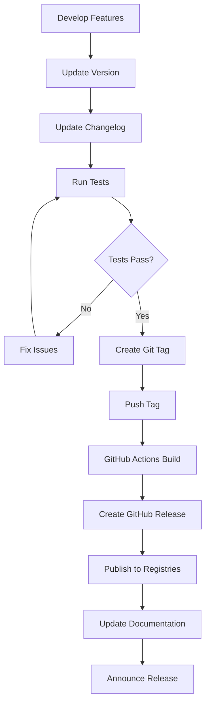

# Release Process Guide

**Version:** 1.0.0  
**Last Updated:** December 20, 2025  
**Target Audience:** Maintainers and Release Managers

---

## Table of Contents

- [Overview](#overview)
- [Versioning Strategy](#versioning-strategy)
- [Release Workflow](#release-workflow)
- [Pre-Release Checklist](#pre-release-checklist)
- [Creating a Release](#creating-a-release)
- [Changelog Management](#changelog-management)
- [Publishing Artifacts](#publishing-artifacts)
- [Release Automation](#release-automation)
- [Hotfix Releases](#hotfix-releases)
- [Rollback Procedures](#rollback-procedures)
- [Post-Release Tasks](#post-release-tasks)
- [Release Metrics](#release-metrics)

---

## Overview

NEXS MCP follows a structured release process to ensure quality, consistency, and reliability. Built with the [official MCP Go SDK](https://github.com/modelcontextprotocol/go-sdk) (`github.com/modelcontextprotocol/go-sdk/mcp v1.1.0`), the project maintains semantic versioning and publishes to multiple distribution channels.

### Release Channels

- **GitHub Releases** - Source code and binaries
- **Go Module Registry** - Go package distribution
- **Docker Hub** - Container images
- **npm Registry** - npm package distribution
- **Homebrew** - macOS package manager

### Release Cadence

- **Major Releases** - When introducing breaking changes (planned)
- **Minor Releases** - New features every 4-6 weeks
- **Patch Releases** - Bug fixes as needed
- **Hotfix Releases** - Critical security/bug fixes (immediate)

---

## Versioning Strategy

### Semantic Versioning

NEXS MCP follows [Semantic Versioning 2.0.0](https://semver.org/):

```
MAJOR.MINOR.PATCH

Example: 1.2.3
         │ │ │
         │ │ └─ Patch: Bug fixes, no API changes
         │ └─── Minor: New features, backward compatible
         └───── Major: Breaking changes
```

### Version Format

```
v<MAJOR>.<MINOR>.<PATCH>[-<PRERELEASE>][+<BUILD>]

Examples:
v0.1.0          # Initial release
v0.2.0          # Minor release with new features
v0.2.1          # Patch release with bug fixes
v1.0.0-beta.1   # Pre-release version
v1.0.0-rc.2     # Release candidate
v1.0.0+20240115 # With build metadata
```

### Version Bumping Rules

**Major Version (Breaking Changes):**
- Removing or renaming MCP tools
- Changing tool input/output schemas incompatibly
- Removing or changing public APIs
- Changing configuration file format incompatibly
- Upgrading to incompatible MCP SDK version

**Minor Version (New Features):**
- Adding new MCP tools
- Adding new features (backward compatible)
- Adding new configuration options
- Enhancing existing tools with optional parameters
- Performance improvements

**Patch Version (Bug Fixes):**
- Bug fixes that don't change behavior
- Security patches
- Documentation updates
- Dependency updates (non-breaking)
- Performance fixes

### Pre-release Versions

```
v1.0.0-alpha.1    # Early development, unstable
v1.0.0-beta.1     # Feature complete, testing
v1.0.0-rc.1       # Release candidate, final testing
```

---

## Release Workflow

### Standard Release Process



### Timeline

**Week Before Release:**
- Code freeze for major features
- Focus on bug fixes and testing
- Update documentation
- Prepare changelog

**Release Day:**
- Final testing
- Version bump
- Create release tag
- Publish artifacts
- Update documentation
- Announce release

**Post-Release:**
- Monitor for issues
- Address critical bugs
- Gather feedback
- Plan next release

---

## Pre-Release Checklist

### Code Quality

- [ ] All tests pass (`make test-race`)
- [ ] Coverage is ≥80% (`make test-coverage`)
- [ ] No linter warnings (`make lint`)
- [ ] Code is formatted (`make fmt`)
- [ ] No security vulnerabilities (`go list -json -deps | nancy sleuth`)

### Documentation

- [ ] README.md is up to date
- [ ] CHANGELOG.md is updated
- [ ] API documentation reflects changes
- [ ] Migration guide prepared (for breaking changes)
- [ ] Examples are tested and working
- [ ] MCP SDK version is documented

### Testing

- [ ] All unit tests pass
- [ ] Integration tests pass
- [ ] MCP protocol tests pass
- [ ] Examples run successfully
- [ ] Manual testing completed
- [ ] Performance benchmarks acceptable

### Dependencies

- [ ] Dependencies are up to date
- [ ] No known security vulnerabilities
- [ ] MCP Go SDK version verified
- [ ] `go.mod` and `go.sum` are clean
- [ ] All licenses are compatible

### Version Management

- [ ] Version number follows semantic versioning
- [ ] Version updated in all relevant files:
  - [ ] `cmd/nexs-mcp/main.go`
  - [ ] `package.json`
  - [ ] `homebrew/nexs-mcp.rb`
  - [ ] Docker files

### Build Verification

- [ ] Builds successfully on all platforms:
  - [ ] Linux (amd64, arm64)
  - [ ] macOS (amd64, arm64)
  - [ ] Windows (amd64)
- [ ] Docker image builds successfully
- [ ] Binaries are properly compressed
- [ ] No debug symbols in production builds

---

## Creating a Release

### Step 1: Update Version Numbers

**Update main.go:**

```go
// cmd/nexs-mcp/main.go
package main

const version = "0.2.0"  // Update this

func main() {
    fmt.Printf("NEXS MCP Server v%s\n", version)
    // ... rest of main
}
```

**Update package.json:**

```json
{
  "name": "nexs-mcp",
  "version": "0.2.0",
  "description": "NEXS MCP Server",
  ...
}
```

**Update Homebrew formula:**

```ruby
# homebrew/nexs-mcp.rb
class NexsMcp < Formula
  desc "NEXS MCP Server"
  homepage "https://github.com/fsvxavier/nexs-mcp"
  version "0.2.0"
  ...
end
```

### Step 2: Update CHANGELOG.md

```bash
# Edit CHANGELOG.md
vim CHANGELOG.md
```

Add new release section:

```markdown
## [0.2.0] - 2025-01-15

### Added
- New portfolio management tools
- Collection installer with dependency resolution
- Enhanced indexing with semantic search
- Support for custom element templates

### Changed
- Improved ensemble execution performance (30% faster)
- Updated MCP Go SDK to v1.1.0
- Enhanced error messages with context

### Fixed
- Memory leak in cache management
- Race condition in concurrent ensemble execution
- Element validation edge cases

### Security
- Updated dependencies with security patches
- Enhanced access control validation
```

### Step 3: Commit Version Changes

```bash
# Stage changes
git add cmd/nexs-mcp/main.go package.json homebrew/nexs-mcp.rb CHANGELOG.md

# Commit with conventional commit format
git commit -m "chore(release): bump version to 0.2.0

- Update version in main.go, package.json, and Homebrew formula
- Add CHANGELOG entry for 0.2.0
- Prepare for release"

# Push to main
git push origin main
```

### Step 4: Create Git Tag

```bash
# Create annotated tag
git tag -a v0.2.0 -m "Release v0.2.0

See CHANGELOG.md for details.

Built with MCP Go SDK v1.1.0"

# Push tag to trigger release workflow
git push origin v0.2.0
```

### Step 5: Monitor Release Workflow

GitHub Actions automatically:
1. Builds binaries for all platforms
2. Runs test suite
3. Generates checksums
4. Creates GitHub release
5. Uploads artifacts
6. Publishes to registries

```bash
# Monitor workflow
gh run watch

# Or view on GitHub
open https://github.com/fsvxavier/nexs-mcp/actions
```

### Step 6: Finalize GitHub Release

1. Go to [Releases page](https://github.com/fsvxavier/nexs-mcp/releases)
2. Find draft release created by workflow
3. Edit release notes:
   - Add highlights
   - Link to changelog
   - Add upgrade instructions
   - Mention breaking changes (if any)
4. Publish release

**Release Template:**

```markdown
# NEXS MCP v0.2.0

This release introduces portfolio management, enhanced indexing, and performance improvements.

## 🎉 Highlights

- **Portfolio Management**: Create and manage AI agent portfolios
- **Semantic Search**: Enhanced indexing with semantic search capabilities
- **Performance**: 30% faster ensemble execution
- **MCP SDK v1.1.0**: Updated to latest official MCP Go SDK

## 📦 Installation

### Using Go
```bash
go install github.com/fsvxavier/nexs-mcp/cmd/nexs-mcp@v0.2.0
```

### Using npm
```bash
npm install -g nexs-mcp@0.2.0
```

### Using Homebrew
```bash
brew install fsvxavier/tap/nexs-mcp
```

### Download Binary
Download the appropriate binary for your platform from the assets below.

## 🔄 Upgrade Guide

For users upgrading from v0.1.x, no breaking changes. Simply update to the latest version.

## 📝 Full Changelog

See [CHANGELOG.md](https://github.com/fsvxavier/nexs-mcp/blob/main/CHANGELOG.md) for complete details.

## 🐛 Bug Reports

If you encounter any issues, please [open an issue](https://github.com/fsvxavier/nexs-mcp/issues).

---

**Built with [MCP Go SDK v1.1.0](https://github.com/modelcontextprotocol/go-sdk)**
```

---

## Changelog Management

### CHANGELOG.md Structure

```markdown
# Changelog

All notable changes to this project will be documented in this file.

The format is based on [Keep a Changelog](https://keepachangelog.com/en/1.0.0/),
and this project adheres to [Semantic Versioning](https://semver.org/spec/v2.0.0.html).

## [Unreleased]

### Added
- Features in development

### Changed
- Changes in development

### Fixed
- Fixes in development

## [0.2.0] - 2025-01-15

### Added
- New features

### Changed
- Changes to existing functionality

### Deprecated
- Features to be removed in upcoming releases

### Removed
- Removed features

### Fixed
- Bug fixes

### Security
- Security fixes and updates

## [0.1.0] - 2024-12-20

Initial release.

[Unreleased]: https://github.com/fsvxavier/nexs-mcp/compare/v0.2.0...HEAD
[0.2.0]: https://github.com/fsvxavier/nexs-mcp/compare/v0.1.0...v0.2.0
[0.1.0]: https://github.com/fsvxavier/nexs-mcp/releases/tag/v0.1.0
```

### Automated Changelog Generation

```bash
# Install git-chglog
go install github.com/git-chglog/git-chglog/cmd/git-chglog@latest

# Generate changelog for version
git-chglog --output CHANGELOG.md v0.2.0

# Generate changelog between versions
git-chglog --output CHANGELOG.md v0.1.0..v0.2.0
```

### Changelog Entry Guidelines

**Good changelog entries:**

```markdown
### Added
- Portfolio management with three new MCP tools (#145)
- Semantic search indexing for faster element discovery (#167)
- Custom element template support (#172)

### Changed
- Ensemble execution now uses concurrent processing, improving performance by 30% (#189)
- Updated MCP Go SDK from v1.0.0 to v1.1.0 for better protocol compliance (#195)

### Fixed
- Memory leak in cache manager affecting long-running servers (#156)
- Race condition in concurrent ensemble execution (#178)
- Element validation incorrectly rejecting valid IDs (#183)
```

**Bad changelog entries:**

```markdown
### Added
- New stuff
- Some improvements

### Fixed
- Bugs
- Issues with things
```

---

## Publishing Artifacts

### GitHub Releases

Automated via GitHub Actions:

```yaml
# .github/workflows/release.yml
name: Release

on:
  push:
    tags:
      - 'v*'

jobs:
  release:
    runs-on: ubuntu-latest
    steps:
      - name: Checkout
        uses: actions/checkout@v4

      - name: Setup Go
        uses: actions/setup-go@v5
        with:
          go-version: 1.25

      - name: Build for all platforms
        run: make build-all

      - name: Create Release
        uses: goreleaser/goreleaser-action@v5
        with:
          version: latest
          args: release --clean
        env:
          GITHUB_TOKEN: ${{ secrets.GITHUB_TOKEN }}
```

### Go Module Registry

Automatic when tag is pushed:

```bash
# Tag automatically published to pkg.go.dev
# Verify after 15-30 minutes
open https://pkg.go.dev/github.com/fsvxavier/nexs-mcp@v0.2.0
```

### Docker Hub

**Automated via Makefile:**

```bash
# Using make command (recommended)
make docker-publish

# This will:
# 1. Load credentials from .env (DOCKER_USER, DOCKER_TOKEN)
# 2. Login to Docker Hub automatically
# 3. Build image with tags: latest and vX.X.X
# 4. Push both tags to Docker Hub
```

**Manual process (if needed):**

```bash
# Build Docker image
docker build -t fsvxavier/nexs-mcp:0.2.0 .
docker build -t fsvxavier/nexs-mcp:latest .

# Login to Docker Hub
docker login

# Push images
docker push fsvxavier/nexs-mcp:0.2.0
docker push fsvxavier/nexs-mcp:latest
```

**Published Images:**
- 🐳 Docker Hub: https://hub.docker.com/r/fsvxavier/nexs-mcp
- 📦 Size: 14.5 MB (compressed), 53.7 MB (uncompressed)
- 🏷️ Tags: latest, v0.1.0, v1.0.5

# Verify
open https://hub.docker.com/r/fsvxavier/nexs-mcp
```

**Automated Docker publishing:**

```yaml
# .github/workflows/docker.yml
name: Docker

on:
  push:
    tags:
      - 'v*'

jobs:
  docker:
    runs-on: ubuntu-latest
    steps:
      - name: Checkout
        uses: actions/checkout@v4

      - name: Docker meta
        id: meta
        uses: docker/metadata-action@v5
        with:
          images: fsvxavier/nexs-mcp
          tags: |
            type=semver,pattern={{version}}
            type=semver,pattern={{major}}.{{minor}}
            type=semver,pattern={{major}}
            type=raw,value=latest

      - name: Login to Docker Hub
        uses: docker/login-action@v3
        with:
          username: ${{ secrets.DOCKER_USERNAME }}
          password: ${{ secrets.DOCKER_TOKEN }}

      - name: Build and push
        uses: docker/build-push-action@v5
        with:
          context: .
          push: true
          tags: ${{ steps.meta.outputs.tags }}
```

### npm Registry

```bash
# Update package.json version (already done in Step 1)

# Login to npm
npm login

# Publish package
npm publish

# Verify
npm view nexs-mcp version
```

**Automated npm publishing:**

```yaml
# .github/workflows/npm.yml
name: Publish to npm

on:
  push:
    tags:
      - 'v*'

jobs:
  publish:
    runs-on: ubuntu-latest
    steps:
      - uses: actions/checkout@v4
      
      - uses: actions/setup-node@v4
        with:
          node-version: '20'
          registry-url: 'https://registry.npmjs.org'

      - name: Publish to npm
        run: npm publish
        env:
          NODE_AUTH_TOKEN: ${{ secrets.NPM_TOKEN }}
```

### Homebrew

```bash
# Update formula in homebrew-tap repository
cd homebrew-tap

# Update nexs-mcp.rb
vim Formula/nexs-mcp.rb
```

Update formula:

```ruby
class NexsMcp < Formula
  desc "NEXS MCP Server - Model Context Protocol implementation"
  homepage "https://github.com/fsvxavier/nexs-mcp"
  version "0.2.0"
  
  on_macos do
    if Hardware::CPU.arm?
      url "https://github.com/fsvxavier/nexs-mcp/releases/download/v0.2.0/nexs-mcp-darwin-arm64"
      sha256 "..." # Calculate: shasum -a 256 nexs-mcp-darwin-arm64
    else
      url "https://github.com/fsvxavier/nexs-mcp/releases/download/v0.2.0/nexs-mcp-darwin-amd64"
      sha256 "..." # Calculate: shasum -a 256 nexs-mcp-darwin-amd64
    end
  end

  on_linux do
    if Hardware::CPU.arm?
      url "https://github.com/fsvxavier/nexs-mcp/releases/download/v0.2.0/nexs-mcp-linux-arm64"
      sha256 "..."
    else
      url "https://github.com/fsvxavier/nexs-mcp/releases/download/v0.2.0/nexs-mcp-linux-amd64"
      sha256 "..."
    end
  end

  def install
    bin.install "nexs-mcp-#{OS.kernel_name.downcase}-#{Hardware::CPU.arch}" => "nexs-mcp"
  end

  test do
    system "#{bin}/nexs-mcp", "--version"
  end
end
```

Commit and push:

```bash
git add Formula/nexs-mcp.rb
git commit -m "Update nexs-mcp to v0.2.0"
git push origin main
```

---

## Release Automation

### GoReleaser Configuration

Create `.goreleaser.yml`:

```yaml
# .goreleaser.yml
project_name: nexs-mcp

before:
  hooks:
    - go mod tidy
    - go mod verify
    - go test -v ./...

builds:
  - id: nexs-mcp
    main: ./cmd/nexs-mcp
    binary: nexs-mcp
    
    env:
      - CGO_ENABLED=0
    
    goos:
      - linux
      - darwin
      - windows
    
    goarch:
      - amd64
      - arm64
    
    ldflags:
      - -s -w
      - -X main.version={{.Version}}
      - -X main.commit={{.Commit}}
      - -X main.date={{.Date}}

archives:
  - id: nexs-mcp
    format: tar.gz
    name_template: >-
      {{ .ProjectName }}_
      {{- .Version }}_
      {{- .Os }}_
      {{- .Arch }}
    
    format_overrides:
      - goos: windows
        format: zip
    
    files:
      - README.md
      - LICENSE
      - CHANGELOG.md
      - docs/**/*

checksum:
  name_template: 'checksums.txt'
  algorithm: sha256

changelog:
  use: github
  sort: asc
  filters:
    exclude:
      - '^docs:'
      - '^test:'
      - '^chore:'
  groups:
    - title: 'New Features'
      regexp: '^feat:'
      order: 0
    - title: 'Bug Fixes'
      regexp: '^fix:'
      order: 1
    - title: 'Performance Improvements'
      regexp: '^perf:'
      order: 2
    - title: 'Other Changes'
      order: 999

release:
  github:
    owner: fsvxavier
    name: nexs-mcp
  
  draft: true
  prerelease: auto
  
  name_template: "v{{.Version}}"
  
  header: |
    ## NEXS MCP v{{.Version}}
    
    Built with [MCP Go SDK v1.1.0](https://github.com/modelcontextprotocol/go-sdk)
  
  footer: |
    **Full Changelog**: https://github.com/fsvxavier/nexs-mcp/compare/{{ .PreviousTag }}...{{ .Tag }}

dockers:
  - image_templates:
      - "fsvxavier/nexs-mcp:{{ .Version }}-amd64"
    use: buildx
    goarch: amd64
    dockerfile: Dockerfile
    build_flag_templates:
      - "--platform=linux/amd64"
      - "--label=org.opencontainers.image.created={{.Date}}"
      - "--label=org.opencontainers.image.version={{.Version}}"
  
  - image_templates:
      - "fsvxavier/nexs-mcp:{{ .Version }}-arm64"
    use: buildx
    goarch: arm64
    dockerfile: Dockerfile
    build_flag_templates:
      - "--platform=linux/arm64"

docker_manifests:
  - name_template: "fsvxavier/nexs-mcp:{{ .Version }}"
    image_templates:
      - "fsvxavier/nexs-mcp:{{ .Version }}-amd64"
      - "fsvxavier/nexs-mcp:{{ .Version }}-arm64"
  
  - name_template: "fsvxavier/nexs-mcp:latest"
    image_templates:
      - "fsvxavier/nexs-mcp:{{ .Version }}-amd64"
      - "fsvxavier/nexs-mcp:{{ .Version }}-arm64"
```

### Release Script

Create `scripts/release.sh`:

```bash
#!/bin/bash

set -e

# Release script for NEXS MCP

VERSION=$1

if [ -z "$VERSION" ]; then
    echo "Usage: ./scripts/release.sh <version>"
    echo "Example: ./scripts/release.sh 0.2.0"
    exit 1
fi

echo "🚀 Starting release process for v$VERSION"

# Validate version format
if ! [[ $VERSION =~ ^[0-9]+\.[0-9]+\.[0-9]+$ ]]; then
    echo "❌ Invalid version format. Use semantic versioning (e.g., 0.2.0)"
    exit 1
fi

# Check if on main branch
BRANCH=$(git rev-parse --abbrev-ref HEAD)
if [ "$BRANCH" != "main" ]; then
    echo "❌ Must be on main branch to release"
    exit 1
fi

# Check for uncommitted changes
if [ -n "$(git status --porcelain)" ]; then
    echo "❌ Uncommitted changes detected. Commit or stash them first."
    exit 1
fi

# Pull latest changes
echo "📥 Pulling latest changes..."
git pull origin main

# Run tests
echo "🧪 Running tests..."
make test

# Update version in files
echo "📝 Updating version numbers..."
sed -i.bak "s/const version = \".*\"/const version = \"$VERSION\"/" cmd/nexs-mcp/main.go
sed -i.bak "s/\"version\": \".*\"/\"version\": \"$VERSION\"/" package.json
sed -i.bak "s/version \".*\"/version \"$VERSION\"/" homebrew/nexs-mcp.rb
rm -f cmd/nexs-mcp/main.go.bak package.json.bak homebrew/nexs-mcp.rb.bak

# Update changelog
echo "📋 Update CHANGELOG.md manually, then press Enter..."
read -r

# Commit changes
echo "💾 Committing version bump..."
git add cmd/nexs-mcp/main.go package.json homebrew/nexs-mcp.rb CHANGELOG.md
git commit -m "chore(release): bump version to $VERSION"

# Create tag
echo "🏷️  Creating tag v$VERSION..."
git tag -a "v$VERSION" -m "Release v$VERSION"

# Push changes
echo "⬆️  Pushing to GitHub..."
git push origin main
git push origin "v$VERSION"

echo "✅ Release v$VERSION initiated!"
echo "📦 GitHub Actions will build and publish artifacts"
echo "👀 Monitor progress: https://github.com/fsvxavier/nexs-mcp/actions"
```

Make executable:

```bash
chmod +x scripts/release.sh
```

Usage:

```bash
./scripts/release.sh 0.2.0
```

---

## Hotfix Releases

### Hotfix Process

For critical bugs or security issues:

```bash
# Create hotfix branch from latest release tag
git checkout -b hotfix/0.2.1 v0.2.0

# Fix the issue
# ... make changes ...

# Commit fix
git add .
git commit -m "fix: critical bug in ensemble execution

Fixes race condition causing data corruption.

Fixes #234"

# Update version (patch bump)
# Update main.go, package.json, etc.

# Update CHANGELOG.md
# Add hotfix section

# Commit version bump
git commit -am "chore(release): bump version to 0.2.1 (hotfix)"

# Merge back to main
git checkout main
git merge hotfix/0.2.1

# Create tag
git tag -a v0.2.1 -m "Hotfix v0.2.1

Critical fix for race condition in ensemble execution."

# Push
git push origin main
git push origin v0.2.1

# Delete hotfix branch
git branch -d hotfix/0.2.1
```

### Security Hotfix

For security vulnerabilities:

1. **DO NOT** create public issue
2. Fix in private branch
3. Prepare security advisory
4. Release hotfix
5. Publish security advisory
6. Notify users

---

## Rollback Procedures

### Rollback a Release

If a release has critical issues:

**1. Create hotfix (preferred):**

```bash
# Create hotfix for the issue
git checkout -b hotfix/0.2.2 v0.2.1
# ... fix issues ...
# Release v0.2.2
```

**2. Revert release (if absolutely necessary):**

```bash
# Delete tag locally and remotely
git tag -d v0.2.1
git push origin :refs/tags/v0.2.1

# Delete GitHub release
gh release delete v0.2.1

# Revert commits
git revert <commit-hash>
git push origin main

# Notify users
```

### Unpublish from Registries

**Go Module:**
- Cannot unpublish from pkg.go.dev
- Create new version with fix

**npm:**
```bash
# Deprecate version
npm deprecate nexs-mcp@0.2.1 "Critical bug, use 0.2.2 instead"

# Or unpublish (within 72 hours)
npm unpublish nexs-mcp@0.2.1
```

**Docker Hub:**
```bash
# Delete tag via Docker Hub UI
# Or use API
```

---

## Post-Release Tasks

### Verify Release

- [ ] GitHub release published
- [ ] Binaries available for download
- [ ] Docker images on Docker Hub
- [ ] npm package published
- [ ] Go module available on pkg.go.dev
- [ ] Homebrew formula updated

### Update Documentation

- [ ] Documentation site updated
- [ ] API docs regenerated
- [ ] Examples tested with new version
- [ ] Migration guide published (if breaking changes)

### Communication

- [ ] Release announcement on GitHub
- [ ] Update README badges
- [ ] Social media announcement (if applicable)
- [ ] Email notifications (if applicable)
- [ ] Update project website

### Monitoring

- [ ] Monitor GitHub issues for bug reports
- [ ] Check error reporting services
- [ ] Review performance metrics
- [ ] Gather user feedback

### Planning

- [ ] Update roadmap
- [ ] Plan next release
- [ ] Create milestone for next version
- [ ] Backlog grooming

---

## Release Metrics

### Track Key Metrics

**Quality Metrics:**
- Test coverage percentage
- Number of bugs found post-release
- Time to fix critical bugs
- Number of hotfixes needed

**Adoption Metrics:**
- Download count
- Docker pulls
- npm installs
- Active users

**Development Metrics:**
- Time from feature complete to release
- Number of commits per release
- Number of contributors
- Code churn

**Example tracking:**

```markdown
## Release v0.2.0 Metrics

**Quality:**
- Test Coverage: 85%
- Post-release Bugs: 2 (1 critical, 1 minor)
- Time to Hotfix: 4 hours
- Hotfixes Required: 1

**Adoption:**
- Downloads (first week): 234
- Docker Pulls: 456
- npm Installs: 123

**Development:**
- Development Time: 6 weeks
- Commits: 87
- Contributors: 5
- Files Changed: 156
```

---

## Best Practices

### Release Checklist Template

Create `.github/RELEASE_CHECKLIST.md`:

```markdown
# Release Checklist for v{{VERSION}}

## Pre-Release
- [ ] All tests pass
- [ ] Coverage ≥80%
- [ ] Documentation updated
- [ ] CHANGELOG.md updated
- [ ] Version bumped in all files
- [ ] Breaking changes documented
- [ ] Migration guide prepared

## Release
- [ ] Tag created and pushed
- [ ] GitHub Actions completed
- [ ] GitHub release published
- [ ] Binaries verified
- [ ] Docker images published
- [ ] npm package published
- [ ] Go module available

## Post-Release
- [ ] Release announcement posted
- [ ] Documentation site updated
- [ ] Monitoring enabled
- [ ] Issues triaged
- [ ] Feedback collected

## Sign-off
- [ ] Release Manager: ___________
- [ ] Tech Lead: ___________
- [ ] Date: ___________
```

### Communication Templates

**Release Announcement:**

```markdown
# 🎉 NEXS MCP v0.2.0 Released!

We're excited to announce the release of NEXS MCP v0.2.0!

## Highlights

- 🎯 **Portfolio Management**: Manage groups of AI agents
- 🔍 **Semantic Search**: Enhanced element discovery
- ⚡ **Performance**: 30% faster ensemble execution
- 📦 **MCP SDK v1.1.0**: Latest official SDK

## Installation

```bash
npm install -g nexs-mcp@0.2.0
```

## Upgrade

```bash
npm update -g nexs-mcp
```

## Learn More

- [Release Notes](https://github.com/fsvxavier/nexs-mcp/releases/tag/v0.2.0)
- [Changelog](https://github.com/fsvxavier/nexs-mcp/blob/main/CHANGELOG.md)
- [Documentation](https://github.com/fsvxavier/nexs-mcp/tree/main/docs)

## Feedback

We'd love to hear your feedback! Please [open an issue](https://github.com/fsvxavier/nexs-mcp/issues) or start a [discussion](https://github.com/fsvxavier/nexs-mcp/discussions).

**Built with ❤️ using [MCP Go SDK](https://github.com/modelcontextprotocol/go-sdk)**
```

---

## Emergency Procedures

### Critical Security Vulnerability

1. **Assess impact** - Determine severity and affected versions
2. **Prepare fix** - Develop and test fix in private
3. **Create security advisory** - Draft GitHub security advisory
4. **Release hotfix** - Follow hotfix process
5. **Publish advisory** - Make security advisory public
6. **Notify users** - Email, GitHub, social media
7. **Monitor** - Watch for exploitation attempts

### Production Outage

1. **Investigate** - Identify root cause
2. **Communicate** - Notify users of issue
3. **Fix** - Deploy hotfix or rollback
4. **Verify** - Confirm issue resolved
5. **Post-mortem** - Document incident and learnings

---

## Tools and Resources

### Release Tools

- **goreleaser** - Release automation
- **git-chglog** - Changelog generation
- **gh** - GitHub CLI
- **docker** - Container management

### Useful Commands

```bash
# View release history
git tag -l --sort=-version:refname

# Compare versions
git diff v0.1.0..v0.2.0

# Show commits since last release
git log $(git describe --tags --abbrev=0)..HEAD --oneline

# Generate release notes
gh release create v0.2.0 --generate-notes
```

---

## Conclusion

A well-executed release process ensures quality, reliability, and user confidence. Follow these guidelines to maintain NEXS MCP's high standards.

**For questions about the release process, contact the maintainers or open a discussion on GitHub.**

---

**Happy Releasing! 🚀**
